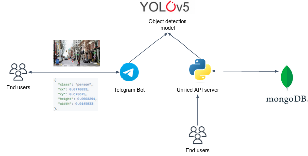
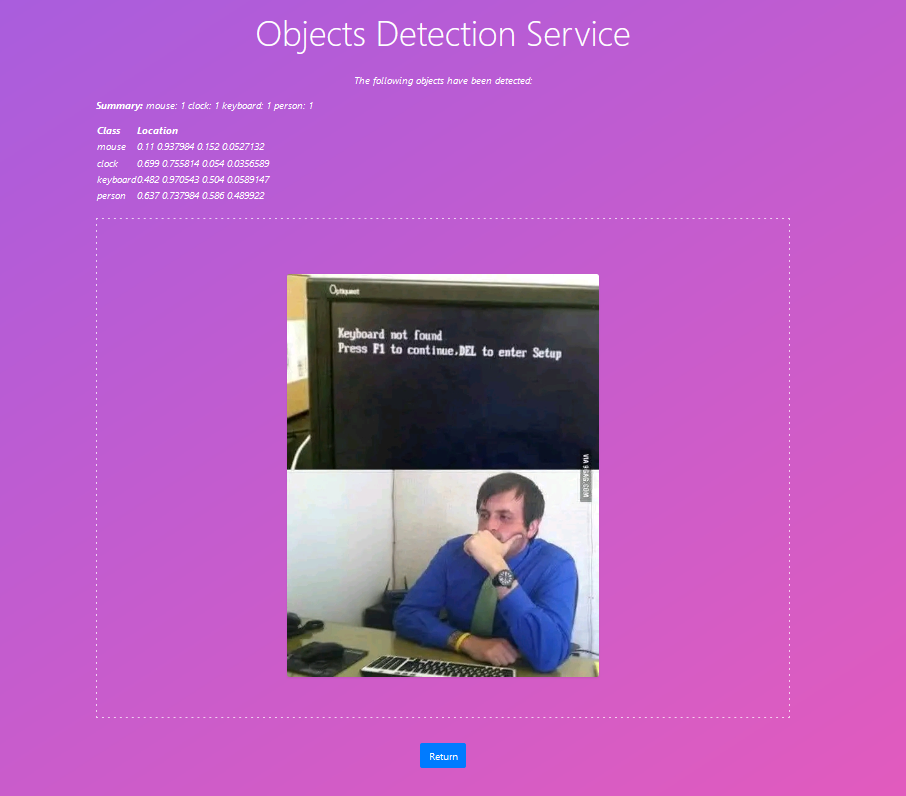
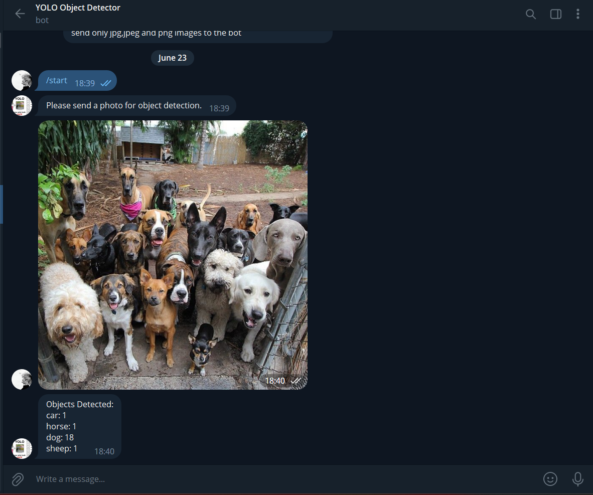

# Yolo5 Object Detection Application

## Introduction

In this project, you are going to design and deploy an image detection service that consists of multiple containers.

The application allows users to upload images and respond with objects that the service detected in the image. Users can interact with the application through a simple web UI or an interactive Telegram bot to obtain object detection results.

The service consists of 4 microservices:

* Telegram Bot container.
* Web UI container.
* Image prediction container based on the Yolo5 pre-train deep learning model.
* MongoDB container to store clients data.

## Architecture



### `Unified API Server`

A pre-built template for the API server is provided. 
This is a lightweight Flask UI which allows users to upload images and be responded with the detected objects.

### `Telegram Bot`

The Telegram bot service is responsible for providing a chat-based interface for users to interact with the service. 
It utilizes the Telegram Bot API to receive user images and respond with detected objects.
It also uses the `Yolo5` service to detect objects in the image,and upload both `orignal` and `predicted` image under an S3 Bucket object.

### `Yolo5`

A pre-built Yolo5 model is used to detect objects in the image, which detects the image for objects
and upload both `orignal` and `predicted` image under an S3 Bucket object.

### `MongoDB`

MongoDB service is used to store persistent data.

## Using the application

The main challenge is resides in configuring the microservices to work together. 
All configuration and integration of all microservices are done in the `docker-compose.yaml` . To run the application, simply run the following command:

```
docker-compose up
```

## Output

Although the model can detect multiple objects in the image, but sometimes it fails to classify the object correctly.

### `Web UI`



### `Telegram Bot`



## Deployment

The application is deployed on **AWS EC2 instance**, with provided roles for accessing S3 bucket.

